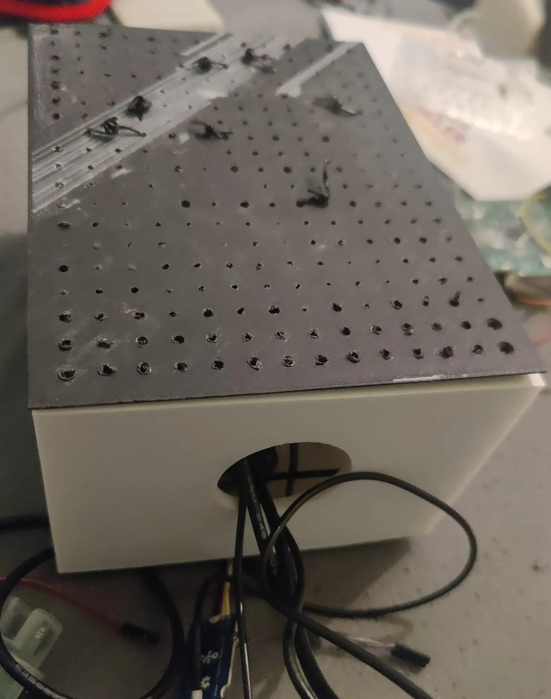
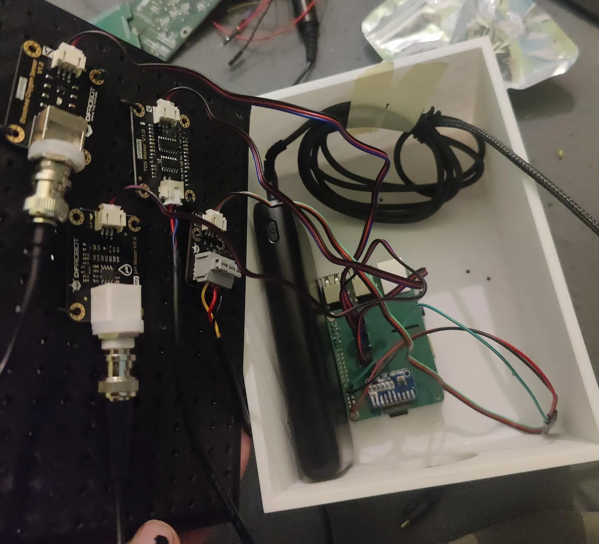

# MORRIGAN
--- 
## What is Morrigan?

Morrigan stands for 
- **M**obile
- **O**ptimized
- **R**eal-time
- **R**essource 
- **I**nterface
- **G**auge
- **A**nalysis
- **N**etwork

and aims to be a simple-to-use device based on the Raspberry Pi 3 to determine the quality of water using sensors from Gravity.

It measures the `total dissolved solids (TDS)(that are conductive), the dissolved oxygen (DO), the temperature, the pH, and the Turbidity`

---
You will find a build log in the [wiki](https://github.com/Leonie-Winter/MORRIGAN/wiki/build_log)[WIP] to find out how to get started

`/src` includes all files for the actual code and `/models` which includes a custom pcb design and a 3d case

 &nbsp;&nbsp;&nbsp;&nbsp;&nbsp;

--- 

If you are interested in thins such as previous competitions,the costs, and how it works check out the [wiki](https://github.com/Leonie-Winter/MORRIGAN/wiki/)

---

**This project was funded by the Erasmus+ program of the European Union.**
